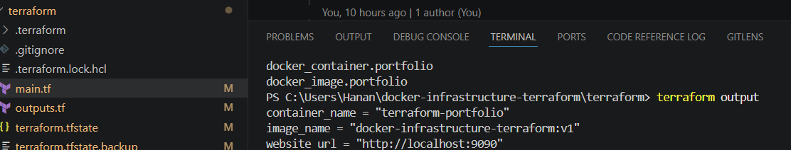

# 🚀 Docker Infrastructure with Terraform

<p align="center">


</p>

---

# 📌 Project Overview

This project demonstrates how to provision and manage containerized infrastructure using **Terraform** and **Docker** following Infrastructure as Code (IaC) principles.

The application is a lightweight static website served by **Nginx** inside a Docker container. Terraform manages the Docker image and container lifecycle through declarative configuration.

This repository is designed as a portfolio project for:

- Cloud Engineer
- DevOps Engineer
- Platform Engineer
- Infrastructure Engineer
- AWS Solutions Architect

---

# 🎯 Project Objectives

- Demonstrate Infrastructure as Code (IaC)
- Deploy Docker containers with Terraform
- Serve a static website using Nginx
- Build reusable infrastructure
- Showcase Cloud Engineering skills
- Demonstrate DevOps best practices

---

# ✨ Features

- Infrastructure as Code (Terraform)
- Docker Container Deployment
- Nginx Web Server
- Static Website Hosting
- Docker Compose Support
- Terraform Variables
- Terraform Outputs
- Infrastructure Automation
- GitHub Actions Ready
- Cloud Portfolio Ready

---

# 🏗 Architecture

```text
                   Browser
                       │
             http://localhost:9090
                       │
                       ▼
               Docker Engine
                       │
                       ▼
            Docker Container
                 (Nginx)
                       │
                       ▼
             Static Website

Terraform CLI
      │
      ▼
Docker Provider
      │
      ▼
Docker API
      │
      ▼
Docker Engine
```

---

# 📂 Project Structure

```text
docker-infrastructure-terraform/

├── app/
│   ├── index.html
│   └── style.css
│
├── architecture/
│   ├── architecture.md
│   ├── architecture.png
│   └── architecture.drawio
│
├── docker/
│   ├── Dockerfile
│   ├── nginx.conf
│   └── .dockerignore
│
├── docs/
│   ├── deployment-guide.md
│   ├── troubleshooting.md
│   └── project-summary.md
│
├── screenshots/
│   ├── homepage.png
│   ├── docker-ps.png
│   ├── terraform-apply.png
│   ├── terraform-output.png
│   └── architecture.png
│
├── terraform/
│   ├── versions.tf
│   ├── variables.tf
│   ├── main.tf
│   ├── outputs.tf
│   ├── terraform.tfvars
│   └── .terraform.lock.hcl
│
├── compose.yaml
├── README.md
├── CHANGELOG.md
├── LICENSE
└── .gitignore
```

---

# 🛠 Technology Stack

| Category | Technology |
|----------|------------|
| Infrastructure as Code | Terraform |
| Containerization | Docker |
| Web Server | Nginx |
| Frontend | HTML5 |
| Styling | CSS3 |
| Container Orchestration | Docker Compose |
| Version Control | Git |
| Repository | GitHub |
| CI/CD | GitHub Actions |

---

# ⚙ Prerequisites

Install the following software before running this project.

- Docker Desktop
- Terraform 1.5+
- Git
- Visual Studio Code

Verify installation

```bash
docker --version

terraform --version

git --version
```

---

# 🚀 Quick Start (Docker Compose)

Clone the repository

```bash
git clone https://github.com/<your-github-username>/docker-infrastructure-terraform.git

cd docker-infrastructure-terraform
```

Build and start the application

```bash
docker compose up -d
```

Verify the container

```bash
docker ps
```

Open your browser

```
http://localhost:8080
```

Stop the application

```bash
docker compose down
```

---

# ☁ Deploy Infrastructure using Terraform

Navigate to the Terraform directory

```bash
cd terraform
```

Initialize Terraform

```bash
terraform init
```

Review the execution plan

```bash
terraform plan
```

Deploy infrastructure

```bash
terraform apply
```

Verify resources

```bash
terraform state list
```

Display outputs

```bash
terraform output
```

Open the deployed application

```
http://localhost:9090
```

---

# ✅ Verification Commands

Verify Docker container

```bash
docker ps
```

Inspect Terraform state

```bash
terraform state list
```

View Terraform outputs

```bash
terraform output
```

Inspect Docker logs

```bash
docker logs terraform-portfolio
```

---

# 📸 Screenshots

Add screenshots after deployment.

```
screenshots/

homepage.png

docker-ps.png

terraform-apply.png

terraform-output.png

architecture.png
```

Example:

```markdown
## Home Page


## Docker Container


## Terraform Apply


## Terraform Output


```

---

# 🔄 CI/CD Pipeline

This repository is designed to support GitHub Actions.

Pipeline stages:

- Checkout Source Code
- Terraform Format Check
- Terraform Validate
- Terraform Plan
- Docker Build
- Docker Image Validation

Future enhancements:

- Push Docker Image to Docker Hub
- Deploy to AWS
- Deploy to Azure
- Deploy to Google Cloud

---

# 🔒 Security Considerations

- Infrastructure managed through Terraform
- Docker image built from official Nginx image
- Reproducible Infrastructure
- Version controlled configuration
- Immutable deployment approach

---

# 📈 Skills Demonstrated

This project demonstrates the following professional skills:

- Infrastructure as Code (IaC)
- Terraform
- Docker
- Nginx
- Linux Containers
- Cloud Infrastructure
- DevOps
- Git
- GitHub
- CI/CD Concepts
- Automation
- Infrastructure Provisioning

---

# 🚀 Future Improvements

- GitHub Actions CI/CD
- Docker Hub Integration
- AWS EC2 Deployment
- Amazon ECS Deployment
- Amazon EKS Deployment
- Terraform Remote State
- Terraform Workspaces
- HTTPS Support
- Load Balancer
- Monitoring with Prometheus
- Grafana Dashboard

---

# 📚 Lessons Learned

Throughout this project, the following concepts were practiced:

- Infrastructure as Code
- Terraform Resource Management
- Docker Image Management
- Docker Container Deployment
- Static Website Hosting
- Nginx Configuration
- Infrastructure Automation
- Troubleshooting Docker and Terraform integration

---

# 👩‍💻 Author

**Natthida Sirapongkulpoj**

Cloud Engineer | Solutions Architect


# ⭐ Support

If you found this project useful, please consider giving it a ⭐ on GitHub.