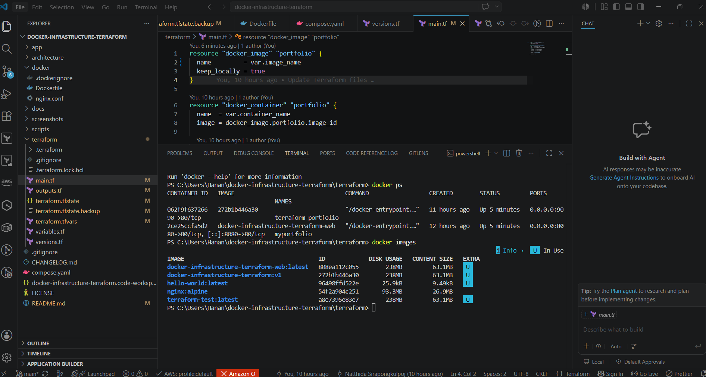
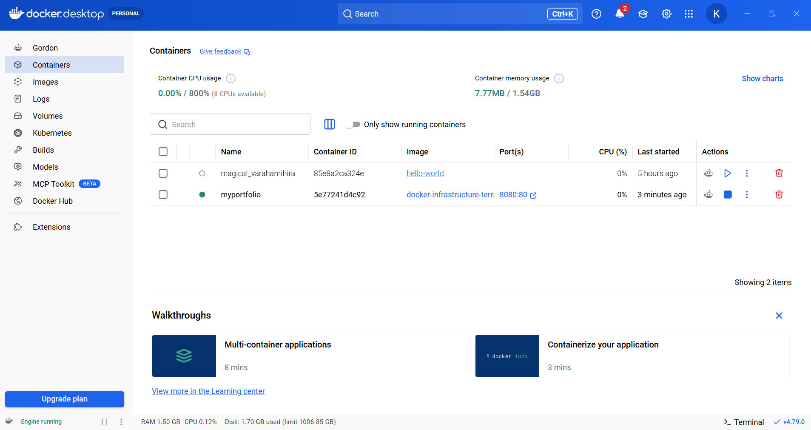
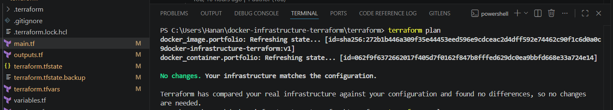
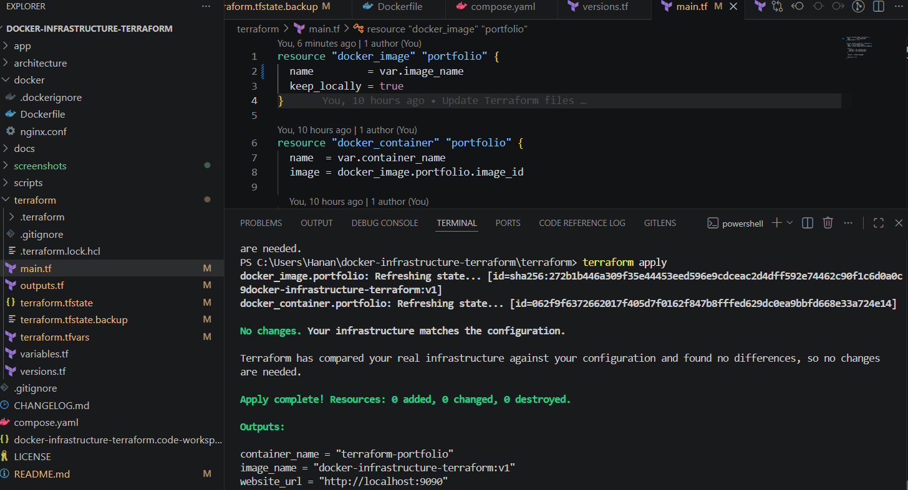
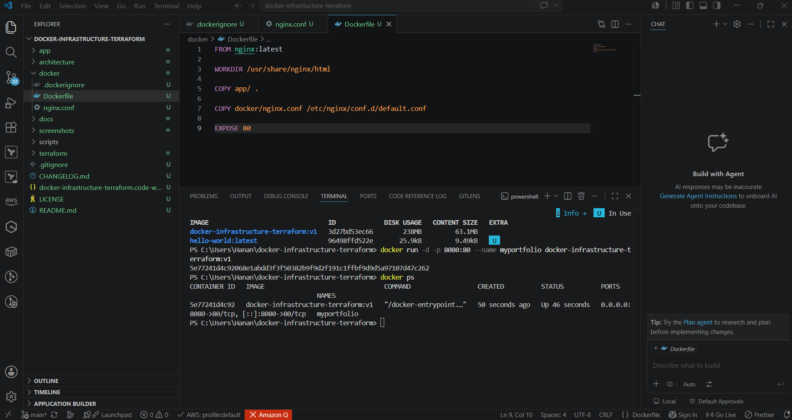
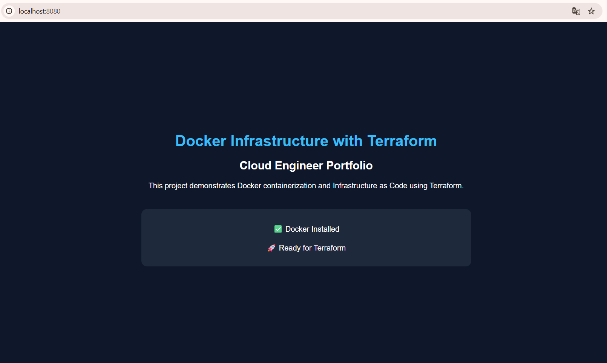

# 🚀 Terraform + Docker Infrastructure


---

# 📌 Project Overview

This project demonstrates how to provision and manage containerized infrastructure using **Terraform** and **Docker** following Infrastructure as Code (IaC) principles.

Instead of manually creating Docker images and containers, Terraform automates the complete deployment workflow, making infrastructure repeatable, version-controlled, and easy to manage.

The project deploys a static portfolio website running on **Nginx** inside a Docker container.

---

# 🎯 Project Objectives

* Learn Infrastructure as Code (IaC) using Terraform
* Build and deploy Docker images
* Provision Docker containers with Terraform
* Configure an Nginx web server
* Manage infrastructure through version control
* Develop a professional Cloud Engineer portfolio project

---

# 🏗 Solution Architecture


---

# 📂 Project Structure

```text
docker-infrastructure-terraform/
│
├── app/
│   ├── index.html
│   └── style.css
│
├── architecture/
│   ├── aws-static-site.drawio
│   ├── aws-static-site.png
│   └── architecture-notes.md
│
├── docker/
│   ├── Dockerfile
│   └── nginx.conf
│
├── docs/
│   ├── deployment-guide.md
│   ├── lessons-learned.md
│   ├── project-summary.md
│   └── troubleshooting.md
│
├── screenshots/
│   ├── docker-build-success.png
│   ├── docker-container-running.png
│   ├── terraform-plan.png
│   ├── terraform-apply.png
│   ├── docker-ps.png
│   └── docker-website-live.png
│
├── terraform/
│   ├── versions.tf
│   ├── variables.tf
│   ├── terraform.tfvars
│   ├── main.tf
│   └── outputs.tf
│
├── compose.yaml
├── README.md
├── LICENSE
└── CHANGELOG.md
```

---

# ⚙ Technologies Used

| Technology     | Purpose                       |
| -------------- | ----------------------------- |
| Terraform      | Infrastructure as Code        |
| Docker         | Containerization              |
| Docker Compose | Local container orchestration |
| Nginx          | Static web server             |
| HTML5          | Static website                |
| CSS3           | Website styling               |
| Git            | Version control               |
| GitHub         | Source code repository        |

---

# 🚀 Deployment Workflow

```text
Developer
     │
     ▼
Git Repository
     │
     ▼
Terraform Init
     │
     ▼
Terraform Plan
     │
     ▼
Terraform Apply
     │
     ▼
Docker Image Build
     │
     ▼
Docker Container
     │
     ▼
Nginx Web Server
     │
     ▼
Static Portfolio Website
```

---

# 📸 Project Screenshots

## Docker Image Build



---

## Docker Container Running



---

## Terraform Plan



---

## Terraform Apply



---

## Docker Container Status



---

## Live Website



---

# 💻 How to Run This Project

## Clone Repository

```bash
git clone https://github.com/NatthidaSirapongkulpoj/docker-infrastructure-terraform.git
```

---

## Navigate to Project

```bash
cd docker-infrastructure-terraform
```

---

## Build Docker Image

```bash
docker build -f docker/Dockerfile -t docker-infrastructure-terraform:v1 .
```

---

## Run Container

```bash
docker run -d -p 8080:80 --name myportfolio docker-infrastructure-terraform:v1
```

---

## Docker Compose

```bash
docker compose up --build -d
```

---

## Terraform Deployment

```bash
cd terraform

terraform init

terraform plan

terraform apply
```

---

## Verify Deployment

```bash
docker ps

terraform output
```

---

# 📚 Skills Demonstrated

* Infrastructure as Code (Terraform)
* Docker Image Management
* Docker Container Deployment
* Docker Networking
* Nginx Configuration
* Static Website Hosting
* Infrastructure Provisioning
* Git & GitHub Workflow
* Linux Container Fundamentals
* Cloud Infrastructure Design
* Infrastructure Documentation
* Technical Troubleshooting

---

# 📖 Lessons Learned

Throughout this project, I gained practical experience in:

* Writing Infrastructure as Code using Terraform
* Building production-ready Docker images
* Deploying and managing Docker containers
* Configuring Nginx as a web server
* Managing infrastructure through version control
* Troubleshooting Docker and Terraform deployment issues
* Organizing cloud infrastructure projects following industry best practices

---

# 👩‍💻 Author

**Natthida Sirapongkulpoj**

Aspiring Cloud Engineer | AWS Solutions Architect | DevOps Enthusiast

GitHub

https://github.com/NatthidaSirapongkulpoj


# ⭐ Support

If you found this project helpful or interesting, please consider giving it a ⭐ on GitHub.

Thank you for visiting this repository!
